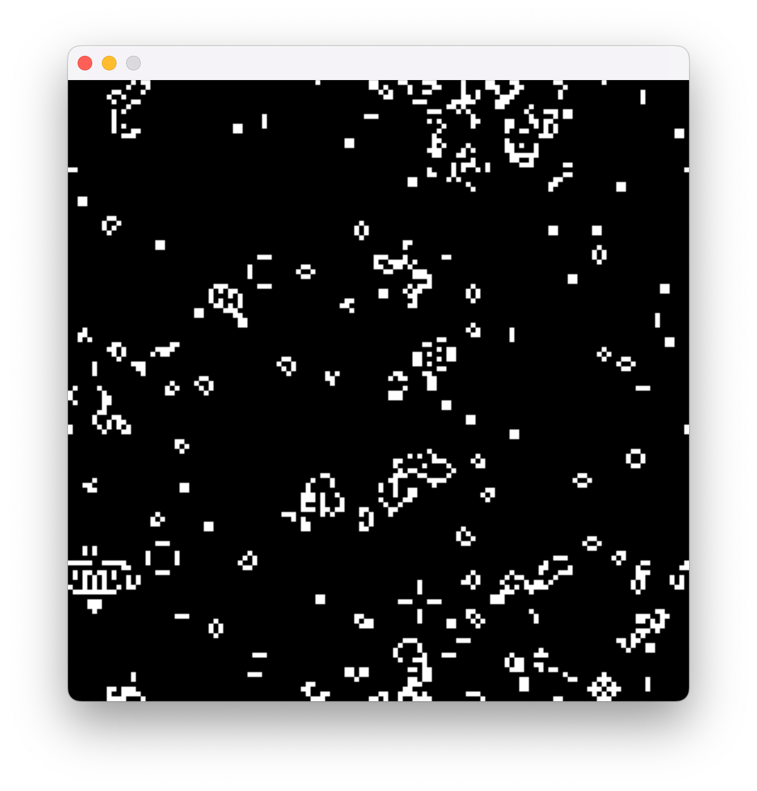
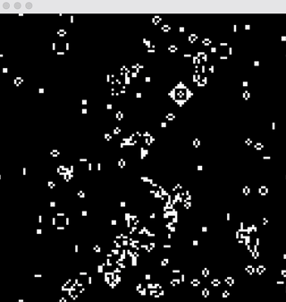

# LLVM Course Project

MacOS is used for development.

Brew is used to install dependencies.

Make is used for building and running the project.

## LAB 1

Implemented Game of live GUI simulation, source code available at dir [sim_app](sim_app/)



Run application from root directory with command:

```bash
make run
```

Demo:



Generate IR from sources with:

```bash
make ir
```

## LAB 2

```md
Второе задание (до 8.10 23:59): С помощью инструментирующего Pass собрать (в рантайме) трассу исполненных IR инструкций / трассу использования инструкций (User <- Operand) графического приложения (только для логического модуля - app.c) на -O1/2/3/s (пропуская User, если это phi*). Код Pass выложить в репозиторий.
Провести анализ часто повторяемых паттернов (длина паттерна: 1-5 инструкций). Собранную статистику выложить в репозиторий.

Задание со звёздочкой: при нахождении операнда из инструкции phi, печатать инструкции, используемые в операндах phi.
Пример: запись shl <- phi заменяется на две записи shl <- add и shl <- sub, если этот phi  использует в качестве операндов add и  sub.
```

```bash
make collect.traces
```

```bash
python3 analyze_stats.py > stats/summary.txt
```

[See stats/](stats/)

## LAB 3

```md
Третье задание (до 22.10 23:59):
Написать (либо сгенерировать) IR генератор графического приложения
+ подключить интерпретацию с пробросом графических функций в ExecutionEngine.
Код IR генератора выложить в репозиторий.
Пример генератора: https://github.com/lisitsynSA/llvm_course/blob/main/SDL/IRGen/app_ir_gen.cpp
```

IR generator located at [ir_gen/](ir_gen/)

## LAB 4

```md
Четвертое задание (до 12.11 23:59): 
1) Свой набор инструкций из статистики для ASM и LLVM IR вашего приложения (описание инструкций выложить в репозиторий) 
2) Переписать приложение на ASM (скинуть в репозиторий)
 
Написать ASM2IR генератор: 
3) С вызовами эмулирующих функций (кроме инструкций потока управления) 
4) С генерацией IR эквивалентов для всех инструкций

Примеры:
2) https://github.com/lisitsynSA/llvm_course/blob/main/SDL/IRGen/app.s
3) https://github.com/lisitsynSA/llvm_course/blob/main/SDL/IRGen/app_asm_IRgen_1.cpp
4) https://github.com/lisitsynSA/llvm_course/blob/main/SDL/IRGen/app_asm_IRgen_2.cpp
```

Check ASM [description](asm2ir/README.md) and ASM-to-IR generators.